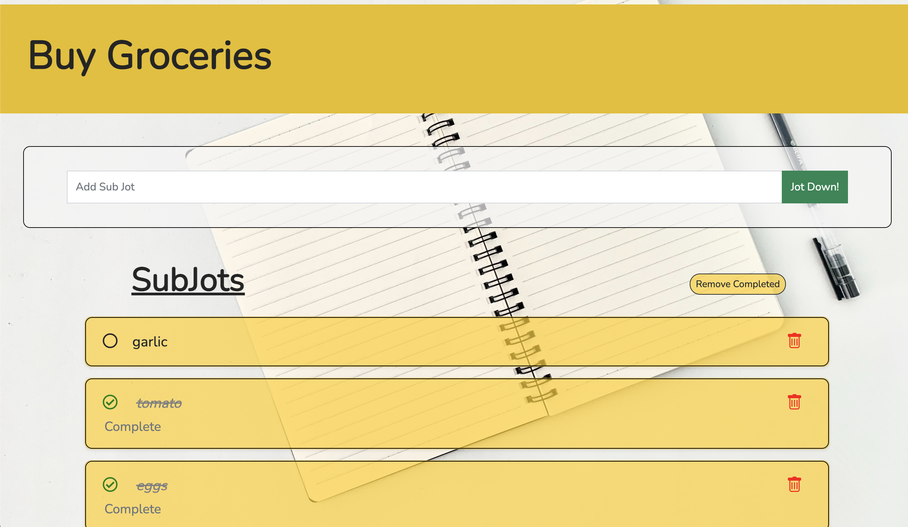

# 📝 JotDown!

## Author: 
### Peter Tran
 

## Background:
How many times have you heard or said, "how could you forget to...." or "you didn't remember to do..." or "I don't remember what they said!"? Yeah, me too.  Never forget any and all things with JotDown! A quick and easy app to easily jot down a task, mark as complete and get things done!
- Check out my app! [JotDown!](https://jotdowntodoapp.herokuapp.com/)
 

## Getting Started:
1.  As you arrive on the home page it'll prompt you to login. If you don't have an account, then you can make one real quick!
    &nbsp; &nbsp; 

2. After logging in, you'll be presented to your homepage. The homepage will display all of your jots. You can quickly add a jot down from the top input bar and the button will let you know you added a jot!
    &nbsp; &nbsp; 

3. You can mark each jot as complete by clicking on the open circle to the left. Once marked as complete, there will be a green check mark on the left, the task will have a strike through the text and it will automatically be moved to the bottom. 
   

4. You have the option to delete an individual jot or even delete all the completed tasks at once! The 'Remove Completed' button will do just that!
   

5. Additionally, say you wanted to make a grocery list and had a generic jot like, "Buy Groceries". If you click on the title, you will be taken into the details page and you'll be able to add in additional subitems like, <i>what</i> to buy. 
   

6. Similar to the main Jots page, you can also mark each subjots as complete, delete each one or remove all completed. 

7. If you decide to logout, it'll return you to the main login screen. 

## Features:
- Django built-in authentication.
- Responsive design for desktop and mobile view.
    &nbsp; &nbsp; 
- Added DOM manipulation to change the 'Jot Down!' button to 'Jot Added!' and change to orange for let the user know it's been added.
   

## What I Used:
- Django
- Python
- PosgreSQL
- JavaScript
- CSS
- Heroku

## Icebox Items:
1. Light/Dark Mode
2. Add modal to view details and add subtasks
3. UI/UX improvements
4. Incorporate a 'Back' button
5. Drag and reorder tasks
6. Refactor code

## Check Out My Wire Frame and ERD:
- You can check out my Trello board [HERE!](https://trello.com/b/Vc4xIQNq/jot-down)

## Credits:
### Wallpaper resources:
  - [Pexels.com](https://www.pexels.com/photo/black-pencil-on-white-paper-68562/)
  <!-- - [Pexels.com](https://www.pexels.com/photo/spiral-notepad-with-lines-near-pen-on-white-background-4295845/unsplash.com)  -->

### Buttons and navbar used found here!
  - [Bootstrap](https://getbootstrap.com/)

### The font I used:
  - [Google Fonts](https://fonts.google.com/specimen/Nunito?query=nunito)
  - [Google Fonts](https://fonts.google.com/specimen/Cedarville+Cursive?query=cedarv)

### Images
  - [freeiconspng.com](https://www.freeiconspng.com/downloadimg/655)